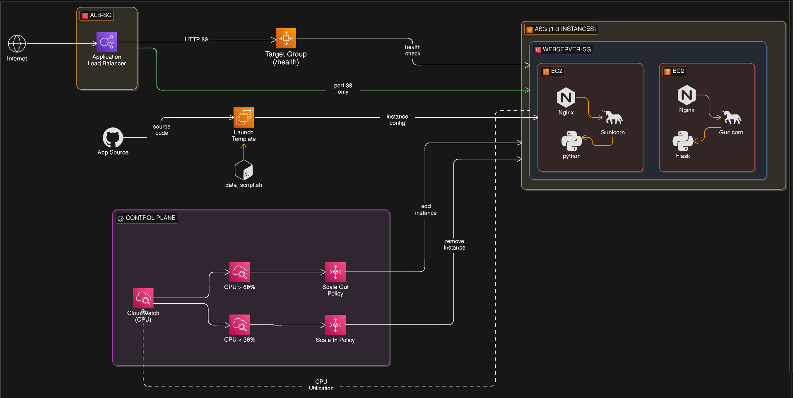

## Self-Healing Architecture for Applications

This repo contains IaC and configuration logic for a self-healing application environment. While the current implementation is demonstrated on AWS, the underlying architectural patterns are cloud-agnostic and can be replicated on any major provider using equivalent managed services.

The system is designed to maintain high availability for containerized or virtualized applications by removing single points of failure and automating the recovery lifecycle.

---

## Why we need this ?

Modern application environments require 24/7 availability. Manual intervention for service recovery is inefficient, prone to error and It will be reactive rather than proactive practice. Infrastructure and application-layer failures are inevitable; therefore, the system must be designed for **resiliency**(the capacity to recover from disruptions and maintain continuous service.)

This architecture solves:

- **Service Unavailability:** Automatically replaces instances that fail application-level health checks.
- **Infrastructure Faults:** Recovers from underlying hardware or hypervisor failures without data-plane interruption.
- **Dynamic Load Handling:** Automates horizontal scaling to maintain performance during peak utilization.

---

## Architecture Overview



The architecture utilizes a decoupled approach to manage application state and traffic flow.

### Core Components

- **Application Load Balancer (ALB):** Serves as the ingress point, distributing traffic across the fleet and performing active health probing.
- **Target Group:** Maintains the registry of healthy application endpoints and defines the protocol/port for health checks.
- **Auto Scaling Group (ASG):** Manages the lifecycle of compute resources, enforcing the "Desired Capacity" and executing replacement logic.
- **Amazon EC2:** Virtual compute instances running the application stack (Nginx, Gunicorn, and the application logic).
- **Launch Template:** Defines the immutable configuration for new instances, including the AMI, security groups, and the `data_script.sh` bootstrap sequence.
- **CloudWatch:** Provides the monitoring plane for resource metrics (CPU, Memory) and triggers scaling actions via alarms.

---

## Self-Healing Mechanism (How it works ?)

The remediation process is driven by automated feedback loops between the monitoring and orchestration layers.

### Health Check Protocols

- **EC2 Status Checks:** Monitors system and instance-level reachability. If the hypervisor or hardware fails, the status check triggers an AWS-level recovery or ASG replacement.
- **ALB Health Checks:** Performs L7 (Application Layer) checks. The load balancer sends periodic requests to a defined `/health` endpoint. If the application returns a non-200 status code or times out, the instance is drained of traffic.

### Automated Remediation Flow

1. **Detection:** The Target Group identifies an instance as `unhealthy`.
2. **Notification:** The ASG receives the health status change.
3. **Replacement:** The ASG terminates the unhealthy instance and provisions a new one based on the **Launch Template**.
4. **Scaling Policies:** CloudWatch Alarms monitor average CPU utilization across the fleet. If thresholds (>60% or <30%) are met, the ASG adjusts the instance count to match demand, ensuring the remaining fleet is not overwhelmed.

---

## Setup and Testing

### 1. Terraform Deployment

Deploy the infrastructure using the provided Terraform manifests.  
**note:** terraform must be installed with aws credentials configured, if you have AWS-CLI already in place it will fetch credientials through it.

```bash
# Initialize the backend and providers
terraform init

# Review the execution plan
terraform plan

# Deploy the infrastructure
terraform apply -auto-approve

```

### 3. Testing and Validation

Verify the self-healing and scaling capabilities by simulating failures.

**Simulate Application Failure:**
Connect to the instance via Session Manager and stop the service to trigger a health check failure.

```bash
sudo systemctl stop testwebsite
```

**Simulate CPU Stress (Scale-Out):**
Install `stress-ng` and saturate the CPU to trigger the CloudWatch Scale-Out alarm.

```bash
sudo yum install stress-ng -y
# Max out CPU for 5 minutes
stress-ng --cpu 4 --timeout 300s

```

**Monitor Remediations:**
View the status of the "healing" process via the AWS CLI or Console:

```bash
aws autoscaling describe-scaling-activities --auto-scaling-group-name <Your-ASG-Name>

```
